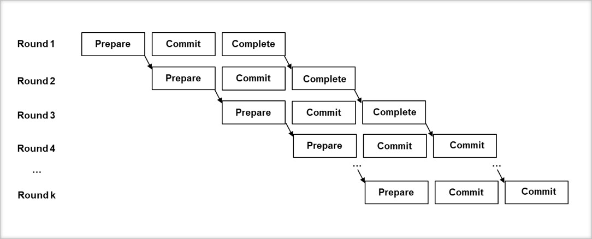

# Sample implementation of various consensus algorithms

## PBFT
### Architecture
#### Overall behavior (4 peers)

Definitions of each abbreviation in the diagram are;

* `m`: Request message object
* `c`: Client ID
* `t`: Timestamp
* `v`: View ID
* `n`: Sequence ID
* `i`: Peer(Node) ID
* `r`: Result of the request's operation

##### Why `count >= 2` ?
In the diagram, the peer change its state to `prepared` or `committed` when the `count` value, which is the number of verified messages from other peers, is larger than `2`.
Actually, the condition is `count >= 2*f` where `f` is the maximum number of faulty peers, which the network can tolerate. In this case, `f` is just `1`, so the condition is `count >= 2`. 

##### What is the reply message?
Every node replies the result of the request's operation to the client individually. The client will collect these reply messages and if `f + 1` valid reply messages are arrived, the client will accept the result.
In this sample implementation, there is no client. So, every node including the primary will return its reply message to the primary.

#### Code structure of the implementation

### Working Screenshot

### Working Screenshot

## License
Apache 2.0