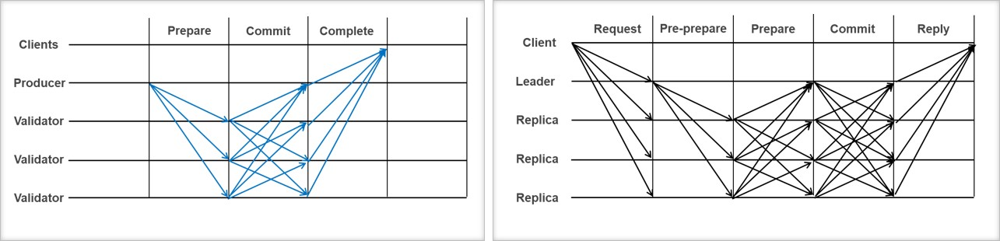

# 블록체인 확장성 개선을 위한 위임형 비잔틴 합의 알고리즘

## <b>PA-BFT(Parallel and Adaptive BFT)

## <b>Safety 및  Liveness
#### Safety 
&nbsp;임의의 커미티 위원 i가 n번째 블록으로 블록 X를 결정한다면, 다른 임의의 커미티 위원 j가 n번째 블록으로 결정하는 블록은 항상 X임을 증명한다. 
&nbsp;(귀류법) 커미티 위원 j가 n번째 블록으로 결정하는 블록을 Y라고 하고, Y는 X와 다르다고 하자. Y가 결정되려면 합의에 필요한 최소 쿼럼인 AQ = f – b + ⌈(n-f+1)/2⌉이상의 commit 메시지를 필요로 한다. AQ 이상의 커미티 위원 집합들은 항상 정상적인 커미티 위원을 교집합으로 가지므로, X에 대해 commit 메시지를 보낸 적어도 하나 이상의 정상적인 커미티 위원이 Y에 대해서도 commit 메시지를 보내야 한다. 정상적인 커미티 위원은 두 개의 블록에 대해 commit 메시지를 보낼 수 없으므로 모순에 도달한다. 

#### Liveness
&nbsp;f개의 비정상적인 커미티 위원이 합의에 협조하지 않는 경우에도 정상적인 커미티 위원만으로 합의에 도달하는 것이 가능함을 증명한다. 
&nbsp;(Case A. 블록 생성자가 비정상) 블록 생성자가 복수의 블록을 제안하거나, 하나의 블록도 제안하지 않는 경우 비잔틴 오류로 판명되어 뷰 체인지를 통해 항상 정상적인 블록 생성자로 교체하는 것이 가능하다. 
&nbsp;(Case B. 블록 생성자가 정상) 최대 f개의 비정상적인 커미티 위원들이 복수의 블록에 commit 메시지를 보내거나, 어떤 commit 메시지도 보내지 않는 경우 모두 비잔틴 오류로 검출이 가능하다. 이 경우 AQ = ⌈(n-f+1)/2⌉이고, 이는 정상적인 커미티 위원들의 총 숫자보다 같거나 작으므로 항상 합의에 도달하는 것이 가능하다. 

## <b>AQUA(Adaptive Quorum Algorithm)
⦁ 런타임에 감지된 오류를 기반으로 합의 정족수를 동적으로 조정 
⦁ 합의에 필요한 최소 정족수 AQ = f – b + ⌈ (n-f+1)/2 ⌉ 
&nbsp;&nbsp;&nbsp;- 위임인 숫자 n, 최대 오류 숫자 f, 비잔틴 오류 숫자 b 
⦁ (효과) PBFT의 5단계를 3단계로 단축 
⦁ (효과) 생기성 보장 및 비잔틴 오류에 대한 강인성  

## <b>Status Diagram

## <b>PPE (Pipelined Parallel Execution)
⦁ 낙관적·예측적(optimistic & speculative) 프로토콜 실행 기법 
⦁ 현재 라운드 합의가 완료되기 전에 새로운 라운드를 개시(pipelining) 
⦁ Digital Signature 및 Message Authentication Code 활용 방법 연구 
⦁ (효과) 단위시간당 처리량 증가(처리시간에 무관) 
⦁ (효과) 타 합의 알고리즘에도 적용이 용이  

## <b>License
Apache 2.0
